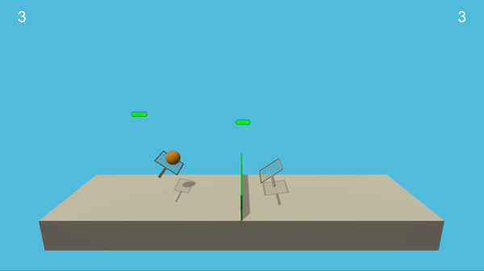

## Tennis (Collabration and Co-operation in reinforcement learning)


### Project Overview

The goal of this project is to train 2 agents in the Unity Tennis environment to play tennis. In this environment, two agents control the rackets to bounce a ball over the net. If an agent hits the ball over the net, it receives a reward of +0.1. If an agent lets a ball hit the ground or hits the ball out of bounds, it receives a reward of -0.01. Thus, the goal of each agent is to keep the ball playing.

The observation space consists of 8 variables corresponding to the positions and velocity of the ball and racket. So in total there are 24 observation bariables. Each agent receives its own, local observation. Two continous actions are available, corresponding to movement toward ( or away fom) the net , and jumping.

The task is episodic, and in order to solve the environment, the agents must get an average score of +0.5 over 100 consecutive episode, after taking the maximum over both the agents



### Algorithms and Techniques

To train agents I used MDDPG algorithm, a DDPG algorithm used for collabration and corporation. As this algorithm states that critic network should contains all the observations and actions that of other agents whereas actor network should only limited to its own observation. Before moving on to MDDPG and implementation let me brief you about the working of DDPG. DDPG involves 2 networks which one is used to get action based on the states entered and the other define Q values based on the actions you have chosen so that actor network could alter their network to choose apropriate states for optimum policy.

In MDDPG, the agents use actor and critic networks for n agents. We can also use one actor network since in this project observations are more or less similar. As well actors should only be there during execution time. Since this project has 2 agents hence I am using 2 actor critic networks. There is also shared buffer implemented and sample produced from shared buffer is used by both agents simultaneously so that one should not otustand other in certain cases.

While chosing actions from actors noise is aldo added to have exploration in the network rather than only exploitation or we can say managing exporation-exploitation tradeoff.

My project has MADDPG class which is wrapper class managing 2 agent for sharing of buffer and accessing information from agents simultaneously. DDPG Agent class is a simple definition of agent which function to execute states to produce action, learn the Actor-Critic network if there are sufficient information, store examples in buffer and reset the noise. My actor and critic network are mostly similar only difference between them are the activation functions. Actor uses RELU and tanh at final implementation. Critic Network uses leaky_relu and no activation at final layer, Both networks are 3 layered and critic does concatenates total actions and total states (that is to take all opponent data as its environment variables).

### Networks

 Actor Network(2 agent x 2 actor networks (local and target):
   - Layer 1 -  24(agent states as input) x  256 - relu
   - Layer 2 -  256 x  256 - relu
   - Layer 3 -  256 x 2 ( agent actions) - tanh

 Critic Network(2 agent x 2 critic networks (local and target):
   - Layer 1 -  (48(both agent) + 4(actions) )x  256 - relu
   - Layer 2 -  256 x  256 - relu
   - Layer 3 -  256 x 1(policy)


Hyperparams used:

```
LR_ACTOR = 5e-4                 # Learning rate of actor model
LR_CRITIC = 5e-3                # Learning rate of critic model
TAU = 8e-2                      # Soft Update Parameter
GAMMA = 0.99                    # Discount Factor
BUFFER_SIZE = int(1e5)          # Replay buffer size
BATCH_SIZE = 260                # Batch size for training models
RANDOM_SEED = 0                 # Seeding
WEIGHT_DECAY = 0.               # Weight decay for Critic Model
UPDATE_EVERY = 20               # weight update frequency
fc1_units = 512                 # number of neurons in hidden layer 1
fc2_units = 256                 # number of neurons in hidden layer 2
```

### Training Results

The agents were trained in 1434 episodes to achive the average score of +0.5 (this average is taken from deques with 100 len).Hence the goal is achieved. The graph for average scores is given below:


### Ideas for Future Work

Hyperparameters change do affect the way training converge a lot however the convergence can be further improves using priority experienced replay. PPO and A3C can also some of the algorithms to provide more stability which DDPG lacks sometimes
